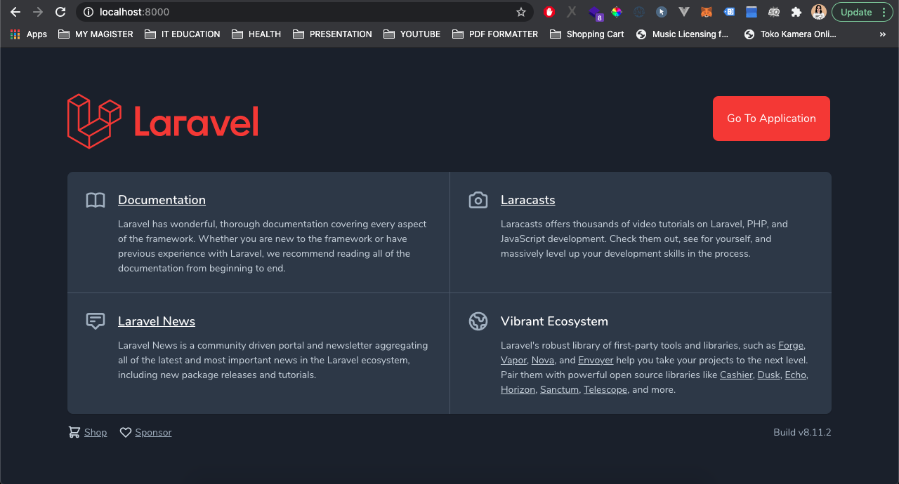
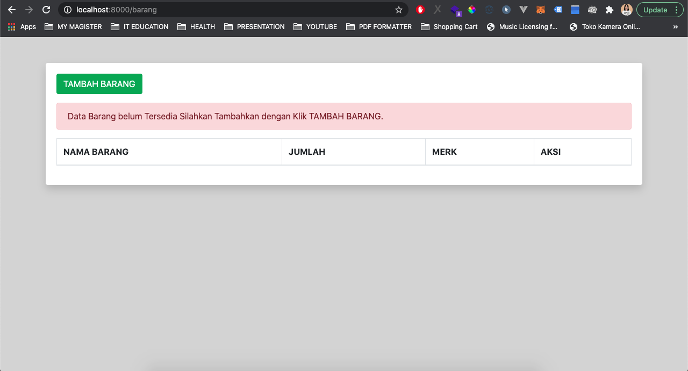
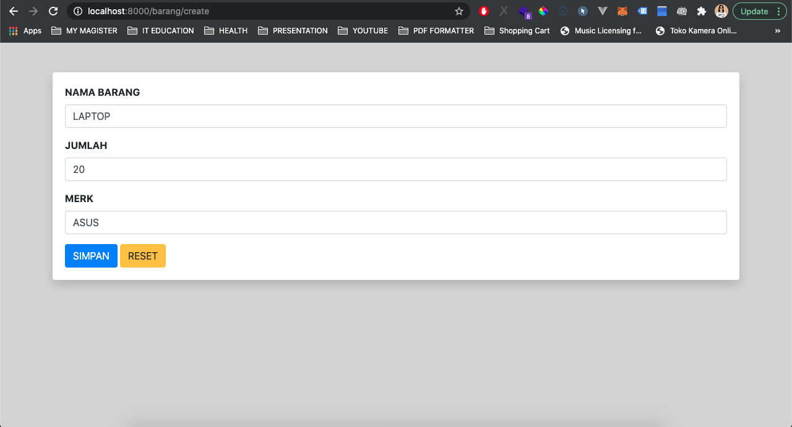
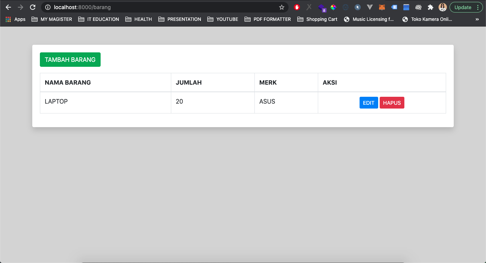

# TEST PROGRAMMER PT NINDYA KARYA (PERSERO)

Aplikasi test programmer yang dibuat oleh Maherdika Erlambang menggunakan Laravel 8.11.2. Pastikan anda mengecek requirement aplikasi pada website [Dokumentasi Laravel](https://laravel.com/docs/8.x) untuk menginstall aplikasi. 

# TUGAS PESERTA

Tugas utama yang diberikan adalah menampilkan data dari tabel Barang dengan metode MVC (Model, View, Controller). Adapun tugas tersebut telah diselesaikan dan ditambahkan fitur CRUD (Create, Read, Update, Delete) untuk keperluan tabel Barang.

## INSTALASI

Menggunakan package manager [composer](https://getcomposer.org/) untuk menginstall aplikasi.

```bash
composer install
```

## PENGGUNAAN

Copy file .env.example atau .env.maherdika untuk membuat setup .env pada server anda dengan perintah

```bash
cp .env.maherdika .env
```

Atau anda dapat melakukan copy paste secara manual.

Generate key untuk .env dengan perintah

```bash
php artisan key:generate
```

Setup .env anda pada atribut

```bash
DB_CONNECTION=mysql
DB_HOST=127.0.0.1
DB_PORT=3306
DB_DATABASE=praktek_nindya
DB_USERNAME=root
DB_PASSWORD=maherbro
```

Dapat disesuaikan dengan versi anda atau dapat mengikuti contoh diatas, namun pastikan DB_PASSWORD anda apakah diberi password atau tidak dan DB_USERNAME anda sesuai dengan username database anda.

Jalankan migration dengan perintah

```bash
php artisan migrate
```

Jalankan aplikasi dengan perintah

```bash
php artisan serve
```

Aplikasi sudah dapat dibuka pada browser anda.

## PANDUAN PENGGUNAAN

* Setelah aplikasi terbuka pada browser silakan klik tombol GO TO APPLICATION.
* Maka tampilan data masih kosong karena database belum berisikan data.
* Silakan tambahkan data dengan Klik TAMBAH BARANG
* Isikan Data Barang dan Simpan
* Anda akan kembali ke halaman utama aplikasi.
* Anda dapat mencoba fitur EDIT dan DELETE.

## SCREENSHOOT APLIKASI




